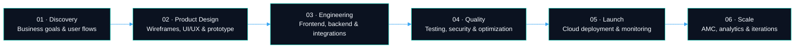

### Ideas are cheap. Shipped products aren't.

**We design, engineer and scale digital products that businesses actually run on.**

 

 

---

## ⚡ Most agencies hand over screens. We hand over a business.

Source code is the easy part. What breaks startups is everything around it — the flow nobody validated, the architecture that folded at 10k users, the deploy nobody documented.

So we own the whole arc:

> **Validate → Design → Engineer → Ship → Measure → Scale**

| Most agencies stop at | We keep going with |
| :--- | :--- |
| Figma files and a repo | A validated business flow before a single line is written |
| "It works on staging" | Production infra, monitoring and rollback paths |
| Feature checklists | Conversion-focused journeys shaped by real user behaviour |
| Project delivered | A product that keeps improving after launch |

**Our goal isn't to finish a project. It's to hand you something ready to operate, improve and scale.**

---

## 🧩 What we build

<table>
<tr>
<td width="50%" valign="top">

### 🌐 Web & SaaS Platforms

- High-performance business websites
- SaaS products and subscription platforms
- Marketplaces and multi-vendor systems
- Customer, vendor and partner portals
- Admin dashboards and operation panels
- E-commerce and custom commerce platforms
- Real-time analytics and reporting systems

</td>
<td width="50%" valign="top">

### 📱 Mobile Applications

- Android and iOS applications
- Flutter and React Native products
- Consumer and enterprise applications
- Delivery, partner and field-force apps
- Wallet, subscription and booking systems
- Real-time chat and notification flows
- Offline-first business applications

</td>
</tr>
<tr>
<td width="50%" valign="top">

### 🤖 AI & Automation

- AI assistants and knowledge-base products
- LLM and OpenAI API integrations
- Workflow and operations automation
- AI-powered search and recommendations
- Document intelligence and data extraction
- Business analytics and insight systems
- Custom AI features inside existing products

</td>
<td width="50%" valign="top">

### ⛓️ Blockchain Solutions

- Blockchain-based verification systems
- Smart contracts and token utilities
- Public record and traceability platforms
- Escrow-based workflows
- NFT and digital asset infrastructure
- Web3 integrations and wallet connectivity
- Custom blockchain product development

</td>
</tr>
</table>

---

## 🛠️ Idea → Product, in six moves

### The delivery model

| Stage | What actually happens |
| :--- | :--- |
| **Discovery & Planning** | Requirements, business flows, scope, priorities, risks and release roadmap |
| **UI/UX & Prototype** | User journeys, wireframes, visual system, responsive screens and a clickable prototype |
| **Architecture** | Database, APIs, integrations, security, infrastructure and scalability planning |
| **Development** | Sprint-based engineering with regular builds, reviews and full progress visibility |
| **Quality Assurance** | Functional testing, edge cases, performance checks and production readiness |
| **Launch & Support** | Deployment, monitoring, maintenance, improvements and future feature releases |

---

## 🧠 How we make technical decisions

<table>
<tr>
<td align="center" width="25%">

### 🎯
**Product First**

Every technical decision starts with the user journey and the business outcome — not the framework we feel like using.

</td>
<td align="center" width="25%">

### 📈
**Built to Scale**

Architecture designed for growth, integrations and traffic you haven't hit yet.

</td>
<td align="center" width="25%">

### 🔐
**Secure by Design**

Role-based access, validation, logging and secure deployment practices from day one.

</td>
<td align="center" width="25%">

### ♾️
**Long-Term Thinking**

Maintainable codebases the next engineer can read — and the business can evolve.

</td>
</tr>
</table>

---

## 🏗️ Selected product highlights

<table>
<tr>
<td width="50%" valign="top">

### 🏏 High-Traffic Sports Platform

Real-time sports experience engineered to survive match-day — when traffic arrives all at once and nothing is allowed to lag.

**Engineering focus**
- High-concurrency architecture
- Fast content delivery and caching
- Real-time match and contest workflows
- Scalable backend services
- Monitoring and continuous optimization

</td>
<td width="50%" valign="top">

### 🍽️ Campus Food Companion

A mobile product built around food discovery, ordering convenience and a genuinely smooth campus experience.

**Product focus**
- Clean, engaging mobile UI
- Real-time menu and order flows
- Digital payment experience
- Location-oriented product journeys
- Android and iOS delivery

</td>
</tr>
<tr>
<td width="50%" valign="top">

### 🛒 Multi-Role Marketplace Systems

Platforms connecting customers, providers, vendors, partners and admins — each with an experience built for their role.

**Common capabilities**
- Multi-role onboarding
- Listing and discovery
- Booking, ordering and subscriptions
- Wallet and payment workflows
- Partner dashboards and admin control

</td>
<td width="50%" valign="top">

### 🤖 AI-Powered Business Platforms

AI shipped inside operational products where it changes the work — not isolated demos that impress once.

**Common capabilities**
- Contextual assistants
- Knowledge-base search
- Document processing
- Automated summaries and recommendations
- Workflow and customer-support automation

</td>
</tr>
</table>

> 🔒 **Why most repos here are private:** client work contains proprietary business logic, production infrastructure and confidential product data. We publish case studies, not client source code.

---

## 💻 Core technology stack

**Frontend & Mobile**

**Backend, Data & Infrastructure**

**AI, Integrations & Product Infrastructure**

---

## 📦 What lands in your hands at the end

<table>
<tr>
<td width="50%" valign="top">

- ✅ Complete UI/UX files and a reusable design system
- ✅ Customer-facing web or mobile applications
- ✅ Admin, vendor, partner and operations dashboards
- ✅ Backend APIs, database and third-party integrations

</td>
<td width="50%" valign="top">

- ✅ Source code in structured, version-controlled repos
- ✅ API, deployment and handover documentation
- ✅ Production deployment and environment setup
- ✅ Maintenance, monitoring and improvement support

</td>
</tr>
</table>

---

## 🤝 Three ways to work with us

<table>
<tr>
<td width="33%" align="center" valign="top">

### 🚀 MVP Launch

Validate a new idea with the right first-version feature set — nothing more, nothing missing.

`Startups · Pilots · Early market testing`

</td>
<td width="33%" align="center" valign="top">

### 🧑‍💻 Dedicated Product Team

A full design and engineering team operating as an extension of your business.

`Long-term development · Continuous releases`

</td>
<td width="33%" align="center" valign="top">

### 🔧 Product Modernization

Rebuild the design, architecture and performance of a platform that has outgrown itself.

`Scale limits · UX debt · Technical debt`

</td>
</tr>
</table>

---

## 🌍 Built in India. Working globally.

**Bengaluru • Noida • Remote collaboration worldwide**

Structured communication, clear milestones, regular product demos, transparent delivery.
No black boxes, no surprise invoices.

 

Have a product idea, an existing platform, or a workflow that's held together by spreadsheets?
Let's turn it into something your users trust and your business can scale.

 

---

<strong>📊 GitHub engineering activity</strong>

 

Product Engineering • Web Development • Mobile Applications • AI Solutions • Blockchain Development

 

© Xenotix Labs — Engineering products built for real growth.

