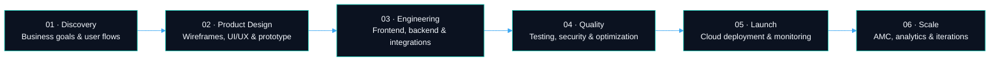

 

  

**Product strategy, UI/UX, engineering, deployment and long-term scaling under one roof.**

We work with startups, growing businesses and product teams to build web, mobile,
AI and blockchain systems that hold up in production.

Bengaluru · Noida · Remote collaboration worldwide

---

## More than a development company

Most agencies stop after delivering screens and source code. We stay involved across the
full product lifecycle:

- validating the business flow before development begins
- creating clean, conversion-focused user experiences
- engineering scalable web, mobile and backend systems
- deploying production-ready infrastructure
- improving the product based on real user feedback
- supporting maintenance, performance and future growth

The goal is not to finish a project. It is to hand over a product that is ready to
operate, improve and scale.

---

## What we build

<table>
<tr>
<td width="50%" valign="top">

### Web and SaaS platforms

- High-performance business websites
- SaaS products and subscription platforms
- Marketplaces and multi-vendor systems
- Customer, vendor and partner portals
- Admin dashboards and operation panels
- E-commerce and custom commerce platforms
- Real-time analytics and reporting systems

</td>
<td width="50%" valign="top">

### Mobile applications

- Android and iOS applications
- Flutter and React Native products
- Consumer and enterprise applications
- Delivery, partner and field-force apps
- Wallet, subscription and booking systems
- Real-time chat and notification flows
- Offline-first business applications

</td>
</tr>
<tr>
<td width="50%" valign="top">

### AI and automation

- AI assistants and knowledge-base products
- LLM and OpenAI API integrations
- Workflow and operations automation
- AI-powered search and recommendations
- Document intelligence and data extraction
- Business analytics and insight systems
- Custom AI features inside existing products

</td>
<td width="50%" valign="top">

### Blockchain solutions

- Blockchain-based verification systems
- Smart contracts and token utilities
- Public record and traceability platforms
- Escrow-based workflows
- NFT and digital asset infrastructure
- Web3 integrations and wallet connectivity
- Custom blockchain product development

</td>
</tr>
</table>

---

## How an idea becomes a product

### Delivery model

| Stage | What happens |
| :--- | :--- |
| Discovery and planning | Requirements, business flows, scope, priorities, risks and release roadmap |
| UI/UX and prototype | User journeys, wireframes, visual system, responsive screens and clickable prototype |
| Architecture | Database, APIs, integrations, security, infrastructure and scalability planning |
| Development | Sprint-based engineering with regular builds, reviews and progress visibility |
| Quality assurance | Functional testing, edge cases, performance checks and production readiness |
| Launch and support | Deployment, monitoring, maintenance, improvements and future feature releases |

---

## Engineering principles

<table>
<tr>
<td align="center" width="25%">

**Product first**

Technical decisions start from the user journey and the business outcome.

</td>
<td align="center" width="25%">

**Built to scale**

Architecture designed for growth, integrations and increasing user demand.

</td>
<td align="center" width="25%">

**Secure by design**

Role-based access, validation, logging and secure deployment practices.

</td>
<td align="center" width="25%">

**Long-term thinking**

Maintainable codebases that can evolve with the product and the business.

</td>
</tr>
</table>

---

## Selected work

<table>
<tr>
<td width="50%" valign="top">

### High-traffic sports platform

A real-time sports product built for match-day load, dynamic data and large-scale
user interaction.

Engineering focus:

- high-concurrency architecture
- fast content delivery and caching
- real-time match and contest workflows
- scalable backend services
- monitoring and continuous optimization

</td>
<td width="50%" valign="top">

### Campus food companion

A mobile product built around food discovery, ordering convenience and campus-specific
usage patterns.

Product focus:

- clean and engaging mobile UI
- real-time menu and order flows
- digital payment experience
- location-oriented product journeys
- Android and iOS delivery

</td>
</tr>
<tr>
<td width="50%" valign="top">

### Multi-role marketplace systems

Platforms connecting customers, service providers, vendors, partners and administrators
through role-based experiences.

Common capabilities:

- multi-role onboarding
- listing and discovery
- booking, ordering and subscriptions
- wallet and payment workflows
- partner dashboards and admin control

</td>
<td width="50%" valign="top">

### AI-powered business platforms

AI features built into operational products rather than standalone demos.

Common capabilities:

- contextual assistants
- knowledge-base search
- document processing
- automated summaries and recommendations
- workflow and customer-support automation

</td>
</tr>
</table>

> Most client repositories are private. They contain proprietary business logic,
> production infrastructure and confidential product information. Case studies are
> shared without exposing client source code.

---

## Technology

**Frontend and mobile**

**Backend, data and infrastructure**

**AI, integrations and product infrastructure**

---

## What clients receive

<table>
<tr>
<td width="50%" valign="top">

- Complete UI/UX design files and a reusable design system
- Customer-facing web or mobile applications
- Admin, vendor, partner and operations dashboards
- Backend APIs, database and third-party integrations

</td>
<td width="50%" valign="top">

- Source code in structured, version-controlled repositories
- API, deployment and handover documentation
- Production deployment and environment setup
- Maintenance, monitoring and improvement support

</td>
</tr>
</table>

---

## Engagement models

<table>
<tr>
<td width="33%" valign="top">

### MVP launch

Validating a new idea with the right first-version feature set.

Best for startups, pilots and early market testing.

</td>
<td width="33%" valign="top">

### Dedicated product team

A design and engineering team working as an extension of your business.

Best for long-term product development and continuous releases.

</td>
<td width="33%" valign="top">

### Product modernization

Improving an existing platform's design, architecture, performance and maintainability.

Best for products facing scale, UX or technical limitations.

</td>
</tr>
</table>

---

## Built in India. Working globally.

Bengaluru · Noida · Remote collaboration worldwide

We work with founders and business teams through structured communication, clear
milestones, regular product demonstrations and transparent delivery.

 

If you have a product idea, an existing platform or a complex workflow that needs
technology behind it, we can help turn it into something your users trust and your
business can scale.

 

---

<strong>GitHub engineering activity</strong>

 

Product engineering · Web development · Mobile applications · AI solutions · Blockchain development

 

© Xenotix Labs

